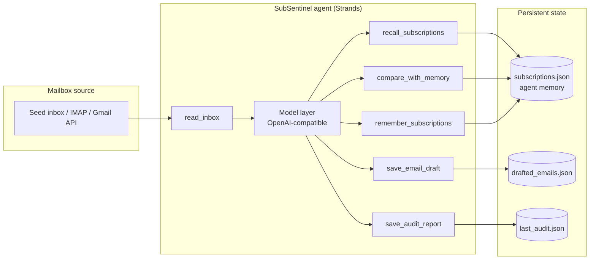

# SubSentinel — an Everyday Agent that stops subscription leaks

> Built for the **Agents for Humans** hackathon (AWS Strands Agents SDK) — *Everyday Agents* track.

SubSentinel is a personal audit agent that watches your inbox for the quiet ways money leaks out of it: subscription renewals, free trials converting to paid plans, sneaky price hikes, and charges that continue after you cancelled.

On every run it:

1. **Reads your inbox** (receipts, renewals, price-change notices)
2. **Extracts subscriptions** — merchant, amount, cadence, last charge date
3. **Remembers across runs** — persistent memory of your subscription picture
4. **Flags changes** — new subscriptions, price hikes > 5 %, apparent cancellations
5. **Drafts the reply** — a cancellation, a negotiation for a loyalty discount, or a refund request, saved ready-to-send
6. **Reports** — a short markdown audit with estimated monthly spend and what changed

Average households bleed hundreds of dollars a year on subscriptions they forgot or never agreed to keep. SubSentinel turns that cleanup into one command.

## Why Strands

SubSentinel is built on the [Strands Agents SDK](https://github.com/strands-agents/sdk-python):

- **Tool-use loop** — the model autonomously chains `read_inbox → recall_subscriptions → compare_with_memory → save_email_draft → remember_subscriptions → save_audit_report`
- **Agent memory** — subscription state persists between runs, so the agent reasons about *change* over time, not just a snapshot
- **Portable model layer** — any OpenAI-compatible endpoint (OpenRouter, OpenAI, vLLM, …) via `OpenAIModel`

## Architecture



The memory tools are what make it an *everyday* agent: run it monthly and it knows exactly what changed since last time — that's where the value is.

## Quickstart

```bash
pip install -r requirements.txt

# Any OpenAI-compatible endpoint
export LLM_API_KEY=sk-...
export LLM_BASE_URL=https://openrouter.ai/api/v1      # optional, defaults to OpenRouter
export LLM_MODEL=nvidia/nemotron-3-super-120b-a12b:free   # any tool-capable model

python agent.py
```

Output lands in `data/`:

- `last_audit.json` — your markdown audit report
- `drafted_emails.json` — ready-to-send cancellation / negotiation drafts
- `subscriptions.json` — the agent's memory, used by the next run

Run it twice to see it work: the second run diffs against the first, flags changes, and remembers.

## Demo

A seeded inbox (`data/seed_inbox.json`) ships with the repo — including a 38 % price hike and a free trial about to convert — so `python agent.py` is a complete demo out of the box. Swap `tools/mailbox.py` for an IMAP/Gmail backend behind the same function signature to run on a real mailbox.

## Roadmap

- Gmail API adapter (the seeded shape is already the adapter's return shape)
- Weekly digest via scheduler
- One-click send from the drafts view (web dashboard)
- Negotiation follow-up tracking (did they answer the loyalty ask?)

## License

MIT — see [LICENSE](LICENSE).
